# Containerlab Workshop: Activity 2 - VS Code Containerlab extension discovery

This activity guides you through deploying and managing Containerlab topologies directly within Visual Studio Code using the official Containerlab extension. You will get familiar with this interface and learn to deploy topologies, interact with nodes via contextual menus and add new elements using the visual editor.

---

## Task 2a: Install the Containerlab VS Code extension

Open the `Extensions` tab on VS Code and search for `Containerlab`. From there, install the extension. It should take just a minute.

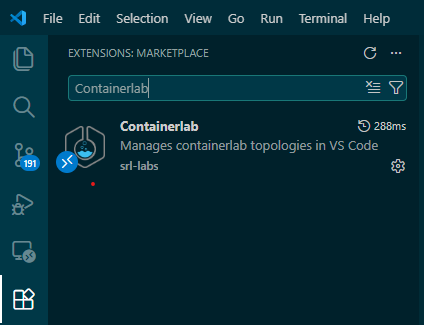

A new tab for Containerlab should now be displayed:

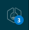

## Task 2b: Deploy a topology with the extension

1. **Navigate to the Containerlab tab and open the topology:**
    * Click on the Containerlab icon in the VS Code Activity Bar (on the left side).
    * Under the "Undeployed Local Labs" section, you should see `02-vscode.clab.yml`. Selecting it will open the topology view with a palette on the right.

    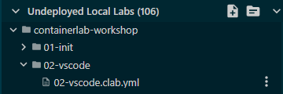

    * On the right, a menu is displayed with multiple options to manipulate the topology.

    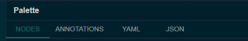

    * Click on one of the nodes - new options will appear on the right menu.

    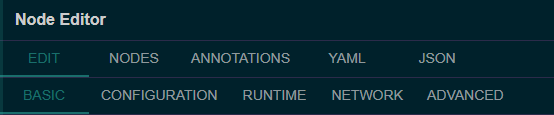

2. **Deploy the Topology:**
    * In the topology view, locate and click the **"Deploy"** button.

    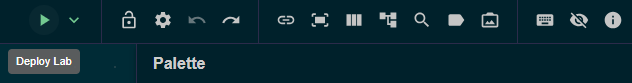

    * *Expected:* The topology will be deployed, and the nodes will transition to a "running" state. You can verify this in the "Running Labs" section of the Containerlab tab.

    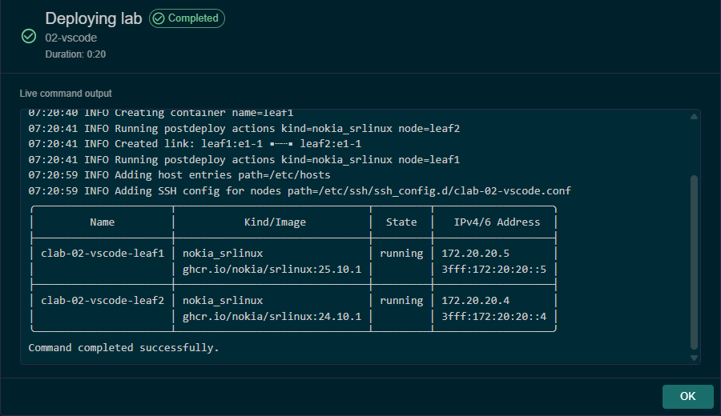

    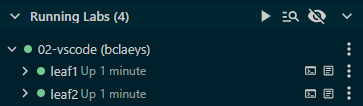

3. **Explore Node Contextual Menus:**
    * **In the Topology View:**
        * Right-click on one of the deployed nodes in the visual topology diagram.
        * Observe the various options available in the contextual menu.

        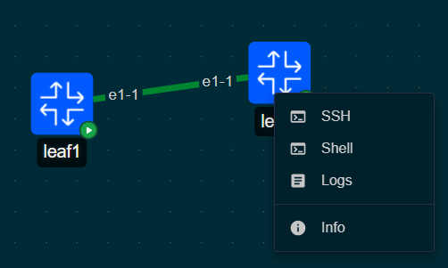

        * Now, right-click on the link and observe the list of options specific to links.

        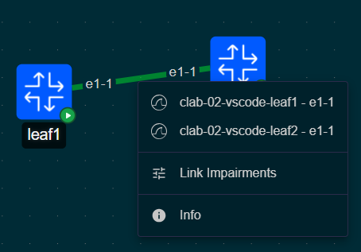

    * **In the Containerlab Tab:**
        * In the Containerlab Activity Bar tab, under "Running Labs," expand `02-vscode`.
        * Right-click successively on the lab, a node and an interface.
        * Observe the contextual menu options for each, which also provide node management actions.

        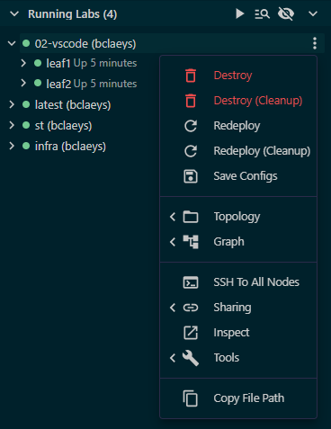
        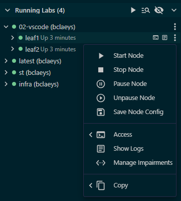
        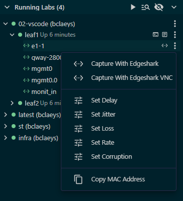

    * **In the Explorer Tab:**
        * In the VS Code File Explorer, right-click on the topology file `02-vscode.clab.yml`.
        * Observe the contextual menu options, which typical actions to deploy or destroy the lab.

## Task 2c: Modify the topology with the extension

1. **Use the Toolbox (Palette) to add elements:**
    * Back to the topology view now! On the right side of the topology view, you'll see a "Toolbox" or "Palette". This allows users to add elements without having to write themselves in the YAML file.
    * **Stop the topology and unlock the canvas**
        * To modify a lab with the topology viewer, it needs to be inactive/not deployed. Since we deployed the lab in the previous steps, it should be destroyed before continuing. Use your preferred method to destroy the lab - a square button is available for this usage. 

        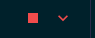

        * By default, the topology viewer is locked to avoid mistakes. Unlock the canvas by clicking on the lock icon:

        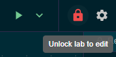

    * **Add a New Node:**
        * *Exercise:* Try to add one more node to your topology using either method:
            * **Drag and Drop:** Drag a node type (e.g., `SR Linux Latest`) from the palette onto the canvas.
            * **Right-Click:** Right-click on an empty space on the canvas and select "Add Node."
    * **Define a Link:**
        * *Exercise:* Next, define a link:
            * Right-click on an existing node (e.g., `leaf1`).
            * Then, click on another node (e.g., your newly added node) to establish a link between them.

2. **Observe live YAML changes:**
    * As you add nodes and links using the visual editor, click on the YAML tab or keep the `02-vscode.clab.yml` file open in a separate editor tab.
    * *Expected:* You will see the YAML file update in real-time to reflect the changes you make in the visual topology view. This demonstrates the seamless synchronization between the graphical interface and the underlying topology definition.
