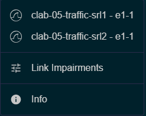

# Containerlab Workshop: Activity 5 - Traffic capture and link impairments

This activity guides you through initiating network traffic, capturing it live using the Containerlab VS Code extension's integration with Wireshark (EdgeShark), and then simulating various link impairments to observe their effects on network communication.

---

## Task 5a: Initiate ping and capture traffic with EdgeShark

This task demonstrates how to generate traffic between two nodes and then use the Containerlab VS Code extension to perform a live traffic capture on a specific link.

1. **Deploy the topology and initiate ping traffic:**
    * Connect to `srl1` (e.g., via the VS Code extension's contextual menu or `docker exec`):

        ```bash
        docker exec -it clab-05-traffic-srl1 sr_cli
        ```

    * Execute the ping command to `srl2`'s interface IP:

        ```bash
        ping 192.168.0.1 network-instance default -c 1000
        ```

    * You should see successful ICMP replies from `srl2`, indicating basic connectivity. Keep this ping running in the background or a separate terminal.

2. **Capture live traffic with EdgeShark:**
    * **Open topology view:** In VS Code, navigate to the Containerlab extension tab and open the visual topology view for your deployed lab.
    * **Right-click link:** Right-click on the link connecting `srl1` and `srl2` in the visual topology diagram.
    * **Select capture option:** From the contextual menu, select one of the Wireshark capture options :

    

    * Wireshark should launch automatically within VS Code and begin displaying live traffic (including the ICMP pings) flowing over that link.

## Task 5b: Add link impairments

This task focuses on simulating various network impairments on a specific interface.

1. **Access "Manage impairments":**
    * In the Containerlab VS Code extension, navigate to the "Running labs" section.
    * Right-click on one of the nodes (e.g., `srl1`) in your deployed lab.
    * Select the "Manage Impairments" option from the contextual menu.
    * A new window or panel will open, displaying options to configure link impairments for all interfaces connected to that node.

2. **Configure impairments for interface 'e1-1-0':**
    * Locate the section for interface `e1-1-0`.
    * For each impairment category, set the specified value and click "Apply" after each change. Observe the effects on the ongoing ping traffic (if still running) and in the Wireshark capture.

    * **Delay:**
        * **Setting:** Add `100ms` delay.
        * **Expected effect:** The ICMP reply packets in your ping output and Wireshark capture will show a significantly longer round-trip time, increasing from typical low milliseconds to over 100ms.

    * **Jitter:**
        * **Setting:** Add `200ms` jitter.
        * **Expected effect:** The return times for ICMP packets will become irregular and highly variable, fluctuating significantly due to the added random delay.

    * **Loss:**
        * **Setting:** Set loss to `50%`.
        * **Expected effect:** Approximately 50% of the ICMP ping packets will be dropped, resulting in a high number of "Request timed out" messages in your ping output.

    * **Rate-limit:**
        * **Preparation:** Before applying the rate-limit, increase the ping packet size to `1000` bytes by modifying the ping command on `srl1`:

            ```bash
            ping 192.168.0.1 network-instance default -c 1000 -s 1000
            ```

        * **Setting:** Apply a rate-limit (e.g., `1kbps` or `10kbps`, depending on desired effect).
        * **Expected effect:** The ping packets will be transmitted at a reduced rate, potentially causing more timeouts or significantly increasing latency if the rate-limit is lower than the required bandwidth for the ping stream.

    * **Corruption:**
        * **Setting:** Set corruption to a specific percentage (e.g., `10%`).
        * **Expected effect:** A percentage of packets will be corrupted, which will manifest as checksum errors in Wireshark or cause packets to be dropped by the receiving node if the corruption is severe enough to render them unreadable.
